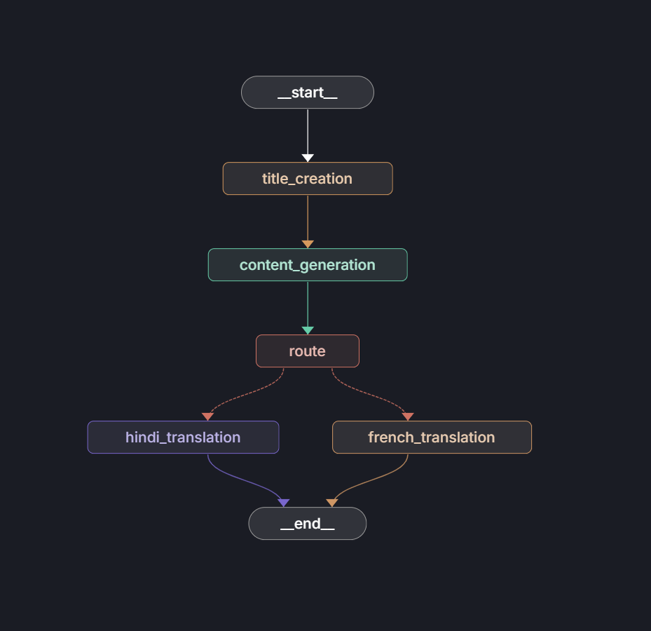

# Agentic AI Blog Generation System

> A production-ready, multi-agent blog generation pipeline built with **LangGraph**, **FastAPI**, and **Groq LLM** — showcasing advanced agentic AI patterns including prompt chaining, conditional routing, structured outputs, and multilingual content generation.

---

## Table of Contents

- [Overview](#overview)
- [Agentic AI Architecture](#agentic-ai-architecture)
- [LangGraph Studio — Graph Visualization](#langgraph-studio--graph-visualization)
- [Prompt Chaining Techniques](#prompt-chaining-techniques)
- [Project Structure](#project-structure)
- [Tech Stack](#tech-stack)
- [FastAPI REST Layer](#fastapi-rest-layer)
- [Getting Started](#getting-started)
- [API Usage](#api-usage)
- [LangGraph Studio](#langgraph-studio)
- [Observability with LangSmith](#observability-with-langsmith)

---

## Overview

This project demonstrates a **fully agentic blog generation system** where a user simply provides a topic (and optionally a target language), and an intelligent multi-node LangGraph pipeline autonomously handles:

1. Generating a creative, SEO-friendly blog title
2. Writing detailed, markdown-formatted blog content
3. Conditionally routing to a language-specific translation agent (Hindi or French)

The system is exposed via a clean **FastAPI** REST interface, visualizable in **LangGraph Studio**, and traced end-to-end through **LangSmith**.

---

## Agentic AI Architecture

The core intelligence of this system lives in a **LangGraph StateGraph** — a directed, stateful computation graph where each node is an autonomous agent performing a discrete reasoning task.

### Agent Nodes

| Node | Role | Agentic Capability |
|---|---|---|
| `title_creation` | Generates a creative, SEO-optimized blog title | Prompt engineering + LLM reasoning |
| `content_generation` | Produces detailed markdown blog content | Long-form generation with structured context |
| `route` | Reads state and decides the next execution path | Stateful decision-making |
| `hindi_translation` | Translates content with cultural adaptation to Hindi | Structured output + cultural reasoning |
| `french_translation` | Translates content with cultural adaptation to French | Structured output + cultural reasoning |

### Graph Modes

The `GraphBuilder` exposes two graph configurations:

- **Topic Graph** — Linear pipeline: `title_creation → content_generation → END`
- **Language Graph** — Full agentic pipeline with conditional branching: `title_creation → content_generation → route → [hindi_translation | french_translation] → END`

This dual-mode design gives the API flexibility to invoke only the processing required, avoiding unnecessary LLM calls.

---

## LangGraph Studio — Graph Visualization

The graph below was visualized live in **LangGraph Studio**, showing the conditional branching logic where the `route` node dynamically dispatches to the appropriate language translation agent.



> **How to read this graph:**
> - `__start__` triggers `title_creation`
> - `title_creation` chains to `content_generation`
> - `content_generation` passes state to `route`
> - `route` uses a **conditional edge** (dashed lines) to branch: `hindi_translation` or `french_translation`
> - Both translation paths converge at `__end__`

---

## Prompt Chaining Techniques

This project uses **explicit prompt chaining** — a core agentic AI technique where the output of one LLM call becomes the structured context for the next, enabling compound reasoning beyond what any single prompt could achieve.

### Chain: Title → Content → Translation

```
[User Input: topic, language]
        │
        ▼
┌─────────────────────────────────────────────────────┐
│  Node 1: title_creation                             │
│  Prompt: "Generate a creative, SEO-friendly title   │
│           for {topic}"                              │
│  Output: blog.title (string)                        │
└──────────────────────┬──────────────────────────────┘
                       │  state carries blog.title forward
                       ▼
┌─────────────────────────────────────────────────────┐
│  Node 2: content_generation                         │
│  Prompt: "Generate detailed markdown blog content   │
│           for {topic}" + preserves title in state   │
│  Output: blog.title + blog.content (Blog schema)    │
└──────────────────────┬──────────────────────────────┘
                       │  state carries full blog forward
                       ▼
┌─────────────────────────────────────────────────────┐
│  Node 3: route (conditional router)                 │
│  Reads: state["current_language"]                   │
│  Routes: → hindi_translation | french_translation   │
└──────────────────────┬──────────────────────────────┘
                       │
          ┌────────────┴────────────┐
          ▼                         ▼
┌──────────────────┐     ┌──────────────────────┐
│  hindi_           │     │  french_              │
│  translation      │     │  translation          │
│                   │     │                       │
│  Prompt: Translate│     │  Prompt: Translate    │
│  blog content to  │     │  blog content to      │
│  Hindi, adapt     │     │  French, adapt        │
│  cultural refs    │     │  cultural refs        │
│                   │     │                       │
│  Structured       │     │  Structured           │
│  Output: Blog{}   │     │  Output: Blog{}       │
└──────────────────┘     └──────────────────────┘
```

### Key Prompt Engineering Patterns Used

- **Role prompting** — Every node assigns the LLM a specialist role (`"You are an expert blog content writer"`)
- **Format enforcement** — Markdown formatting is explicitly requested to ensure consistent, renderable output
- **Cultural adaptation** — The translation prompt goes beyond literal translation: *"Adapt cultural references and idioms to be appropriate for {language}"*
- **Structured output binding** — `llm.with_structured_output(Blog)` enforces schema-validated responses via Pydantic, eliminating hallucinated or malformed JSON

---

## Project Structure

```
Blog-Generation/
│
├── app.py                        # FastAPI application entrypoint
├── main.py                       # CLI entrypoint
├── langgraph.json                # LangGraph Studio configuration
├── requirements.txt              # Python dependencies
├── pyproject.toml                # Project metadata
├── .env                          # Environment variables (not committed)
│
├── assets/
│   └── langgraph_studio.png      # LangGraph Studio graph screenshot
│
└── src/                          # Core modular source package
    │
    ├── __init__.py
    │
    ├── graphs/                   # Graph construction layer
    │   ├── __init__.py
    │   └── graph_builder.py      # GraphBuilder class — builds & compiles graphs
    │
    ├── nodes/                    # Agent node logic layer
    │   ├── __init__.py
    │   └── blog_node.py          # BlogNode class — all LLM reasoning nodes
    │
    ├── states/                   # Shared state schema layer
    │   ├── __init__.py
    │   └── blogstate.py          # BlogState TypedDict + Blog Pydantic model
    │
    └── llms/                     # LLM provider abstraction layer
        ├── __init__.py
        └── groqllm.py            # GroqLLM class — Groq API wrapper
```

### Modularity Principles

Each layer has a single responsibility:

| Layer | Responsibility | Class |
|---|---|---|
| `src/llms/` | LLM provider abstraction — swap Groq for OpenAI with zero graph changes | `GroqLLM` |
| `src/states/` | Shared state contract — all nodes read/write the same typed schema | `BlogState`, `Blog` |
| `src/nodes/` | Pure reasoning logic — each method is an independent, testable agent node | `BlogNode` |
| `src/graphs/` | Graph topology — wires nodes and edges, compiles the runnable graph | `GraphBuilder` |
| `app.py` | HTTP transport layer — FastAPI routes that invoke the graph | — |

This separation means you can:
- **Swap the LLM** (e.g., OpenAI, Anthropic) by creating a new class in `src/llms/` with a `get_llm()` method
- **Add new nodes** (e.g., SEO scoring, image generation) in `src/nodes/` without touching the API
- **Extend graph topologies** by adding new `build_*_graph()` methods to `GraphBuilder`

---

## Tech Stack

| Technology | Role |
|---|---|
| **LangGraph** | Stateful multi-agent graph orchestration |
| **LangChain** | LLM abstraction, message formatting, structured output |
| **FastAPI** | High-performance async REST API layer |
| **Uvicorn** | ASGI server for FastAPI |
| **Groq + Llama 3.1 8B** | Ultra-fast LLM inference |
| **LangSmith** | End-to-end LLM observability and tracing |
| **LangGraph Studio** | Visual graph debugging and execution |
| **Pydantic** | Structured output schema validation |
| **Python-dotenv** | Secure environment variable management |

---

## FastAPI REST Layer

The API layer ([app.py](app.py)) is intentionally thin — it handles HTTP concerns only and delegates all intelligence to the graph layer.

```python
@app.post("/blogs")
async def create_blogs(request: Request):
    data = await request.json()
    topic = data.get("topic", "")
    language = data.get("language", "")

    llm = GroqLLM().get_llm()
    graph_builder = GraphBuilder(llm)

    if topic and language:
        graph = graph_builder.setup_graph(usecase="language")   # full agentic pipeline
        state = graph.invoke({"topic": topic, "current_language": language.lower()})
    elif topic:
        graph = graph_builder.setup_graph(usecase="topic")      # topic-only pipeline
        state = graph.invoke({"topic": topic})

    return {"data": state}
```

**Design decisions:**
- `async def` — non-blocking request handling via FastAPI's async support
- Graph is instantiated per-request — stateless, thread-safe, horizontally scalable
- `usecase` flag drives which graph topology is compiled — no unnecessary agents are loaded
- Returns the raw LangGraph state dict, giving clients full visibility into all intermediate outputs

---

## Getting Started

### Prerequisites

- Python 3.11+
- [Groq API Key](https://console.groq.com)
- [LangSmith API Key](https://smith.langchain.com) (optional, for tracing)

### Installation

```bash
# Clone the repository
git clone <repo-url>
cd Blog-Generation

# Install dependencies
pip install -r requirements.txt
```

### Environment Setup

Create a `.env` file in the project root:

```env
GROQ_API_KEY=your_groq_api_key_here
LANGCHAIN_API_KEY=your_langsmith_api_key_here
LANGCHAIN_TRACING_V2=true
LANGCHAIN_PROJECT=blog-generation-agent
```

### Run the API Server

```bash
python app.py
# Server starts at http://0.0.0.0:8000
# Interactive docs available at http://localhost:8000/docs
```

---

## API Usage

### Generate a Blog (English only)

```bash
curl -X POST http://localhost:8000/blogs \
  -H "Content-Type: application/json" \
  -d '{"topic": "The Future of Quantum Computing"}'
```

### Generate a Blog with Hindi Translation

```bash
curl -X POST http://localhost:8000/blogs \
  -H "Content-Type: application/json" \
  -d '{"topic": "The Future of Quantum Computing", "language": "hindi"}'
```

### Generate a Blog with French Translation

```bash
curl -X POST http://localhost:8000/blogs \
  -H "Content-Type: application/json" \
  -d '{"topic": "The Future of Quantum Computing", "language": "french"}'
```

### Sample Response

```json
{
  "data": {
    "topic": "The Future of Quantum Computing",
    "blog": {
      "title": "# Quantum Leaps: How Quantum Computing Will Redefine Our Digital Future",
      "content": "## Introduction\n\nImagine a computer that can solve in seconds what today's machines need centuries to crack..."
    },
    "current_language": "hindi"
  }
}
```

---

## LangGraph Studio

The graph is registered for **LangGraph Studio** via [langgraph.json](langgraph.json):

```json
{
  "dependencies": ["."],
  "graphs": {
    "blog_generator_agent": "./src/graphs/graph_builder.py:graph"
  },
  "env": "./.env"
}
```

To launch LangGraph Studio locally:

```bash
# Start the studio server
langgraph dev
```

LangGraph Studio lets you:
- **Visually inspect** the graph topology — nodes, edges, and conditional branches
- **Execute the graph interactively** — provide inputs and watch state flow through each node in real time
- **Debug node by node** — inspect the exact state entering and leaving every agent
- **Replay executions** — re-run past traces to reproduce bugs

---

## Observability with LangSmith

Every graph execution is automatically traced to LangSmith when `LANGCHAIN_API_KEY` is set. Each trace captures:

- **Node-level inputs and outputs** — inspect exactly what each agent node received and produced
- **LLM call latency** — per-node timing for performance optimization
- **Token usage** — track costs across the full prompt chain
- **Full state history** — replay any execution to debug unexpected outputs

---

## Extending the System

### Add a New Language

1. Add a conditional node in [graph_builder.py](src/graphs/graph_builder.py) using the existing `translation` lambda pattern
2. Add the branch mapping in `route_decision` inside [blog_node.py](src/nodes/blog_node.py)

### Add a New LLM Provider

1. Create `src/llms/openaillm.py` with a `get_llm()` method returning a LangChain-compatible LLM
2. Instantiate it in [app.py](app.py) — zero changes to nodes, states, or graphs required

### Add New Content Agents

Examples of nodes you could chain after `content_generation`:

- `seo_optimizer` — score and improve keyword density
- `image_prompt_generator` — produce DALL-E prompts for blog hero images
- `social_media_summarizer` — generate LinkedIn/Twitter snippets from the blog
